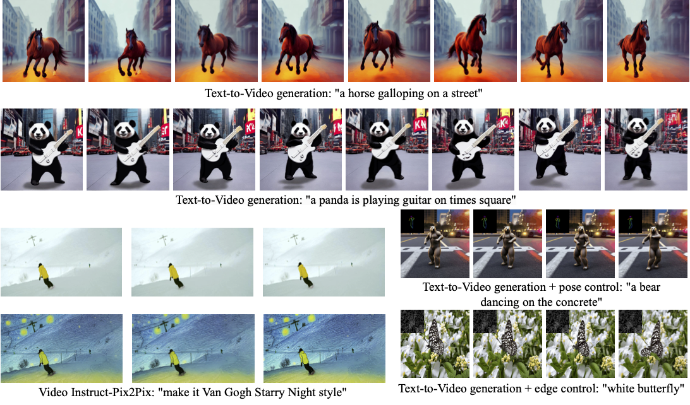

<!--Copyright 2023 The HuggingFace Team. All rights reserved.

Licensed under the Apache License, Version 2.0 (the "License"); you may not use this file except in compliance with
the License. You may obtain a copy of the License at

http://www.apache.org/licenses/LICENSE-2.0

Unless required by applicable law or agreed to in writing, software distributed under the License is distributed on
an "AS IS" BASIS, WITHOUT WARRANTIES OR CONDITIONS OF ANY KIND, either express or implied. See the License for the
specific language governing permissions and limitations under the License.
-->

# Zero-Shot Text-to-Video Generation 

## Overview

[Text2Video-Zero: Text-to-Image Diffusion Models are Zero-Shot Video Generators](https://arxiv.org/abs/2303.13439) <br />
Levon Khachatryan,
Andranik Movsisyan,
Vahram Tadevosyan,
Roberto Henschel,
[Zhangyang Wang](https://www.ece.utexas.edu/people/faculty/atlas-wang), Shant Navasardyan, [Humphrey Shi](https://www.humphreyshi.com)

Our method Text2Video-Zero enables zero-shot video generation using either
1. A textual prompt, or
2. A prompt combined with guidance from poses or edges, or 
3. Video Instruct-Pix2Pix, i.e., instruction-guided video editing. 
<br />
Results are temporally consistent and follow closely the guidance and textual prompts.



The abstract of the paper is the following:

*Recent text-to-video generation approaches rely on computationally heavy training and require large-scale video datasets. In this paper, we introduce a new task of zero-shot text-to-video generation and propose a low-cost approach (without any training or optimization) by leveraging the power of existing text-to-image synthesis methods (e.g., Stable Diffusion), making them suitable for the video domain.
Our key modifications include (i) enriching the latent codes of the generated frames with motion dynamics to keep the global scene and the background time consistent; and (ii) reprogramming frame-level self-attention using a new cross-frame attention of each frame on the first frame, to preserve the context, appearance, and identity of the foreground object.
Experiments show that this leads to low overhead, yet high-quality and remarkably consistent video generation. Moreover, our approach is not limited to text-to-video synthesis but is also applicable to other tasks such as conditional and content-specialized video generation, and Video Instruct-Pix2Pix, i.e., instruction-guided video editing.
As experiments show, our method performs comparably or sometimes better than recent approaches, despite not being trained on additional video data*


Resources:

* [Project Page](https://text2video-zero.github.io/)
* [Paper](https://arxiv.org/abs/2303.13439)
* [Original Code](https://github.com/Picsart-AI-Research/Text2Video-Zero)


## Available Pipelines:

| Pipeline | Tasks | Demo
|---|---|:---:|
| [TextToVideoZeroPipeline](https://github.com/huggingface/diffusers/blob/main/src/diffusers/pipelines/text_to_video_synthesis/pipeline_text_to_video_zero.py) | *Zero-shot Text-to-Video Generation* | [🤗 Space](https://huggingface.co/spaces/PAIR/Text2Video-Zero)


## Usage example

### Text-To-Video

To generate a video from prompt, run the following python command
```python
import torch
from diffusers import TextToVideoZeroPipeline

model_id = "runwayml/stable-diffusion-v1-5"
pipe = TextToVideoZeroPipeline.from_pretrained(model_id, torch_dtype=torch.float16).to("cuda")

prompt = "A panda is playing guitar on times square"
result = pipe(prompt=prompt).images
imageio.mimsave("video.mp4", result, fps=4)
```
You can change these parameters in the pipeline call:
* Motion field strength (see the [paper](https://arxiv.org/abs/2303.13439), Sect. 3.3.1):
    * `motion_field_strength_x` and `motion_field_strength_y`. Default: `motion_field_strength_x=12`, `motion_field_strength_y=12`
* `T` and `T'` (see the [paper](https://arxiv.org/abs/2303.13439), Sect. 3.3.1)
    * `t0` and `t1` in the range `{0, ..., num_inference_steps}`. Default: `t0=45`, `t1=48`
* Video length:
    * `video_length`, the number of frames video_length to be generated. Default: `video_length=8`


### Text-To-Video with Pose Control
To generate a video from prompt with additional pose control, follow these steps

Read video containing extracted pose images from path
```python
import imageio

reader = imageio.get_reader("path/to/your/pose/video", "ffmpeg")
frame_count = 8
pose_images = [Image.fromarray(reader.get_data(i)) for i in range(frame_count)]
```
To extract pose from actual video, read [ControlNet documentation](./stable_diffusion/controlnet).

Run `StableDiffusionControlNetPipeline` with our custom attention processor

```python
import torch
from diffusers import StableDiffusionControlNetPipeline, ControlNetModel
from diffusers.pipelines.text_to_video_synthesis.pipeline_text_to_video_zero import CrossFrameAttnProcessor

model_id = "runwayml/stable-diffusion-v1-5"
controlnet = ControlNetModel.from_pretrained("lllyasviel/sd-controlnet-openpose", torch_dtype=torch.float16)
pipe = StableDiffusionControlNetPipeline.from_pretrained(
    model_id, controlnet=controlnet, torch_dtype=torch.float16
).to("cuda")
pipe.unet.set_attn_processor(CrossFrameAttnProcessor(batch_size=2))

prompt = "Darth Vader dancing in a desert"
result = pipe(prompt=[prompt] * len(pose_images), image=pose_images).images
imageio.mimsave("video.mp4", result, fps=4)
```


### Text-To-Video with Edge Control
To generate a video from prompt with additional pose control, follow the steps described above for pose-guided generation using canny edge ControlNet model <br/>


### Video Instruct-Pix2Pix
To perform text-guided video editing, run the following python command:

Read video from path
```python
import imageio

reader = imageio.get_reader("path/to/your/video", "ffmpeg")
frame_count = 8
video = [Image.fromarray(reader.get_data(i)) for i in range(frame_count)]
```

Run `StableDiffusionInstructPix2PixPipeline` with our custom attention processor
```python
import torch
from diffusers import StableDiffusionInstructPix2PixPipeline
from diffusers.pipelines.text_to_video_synthesis.pipeline_text_to_video_zero import CrossFrameAttnProcessor

model_id = "timbrooks/instruct-pix2pix"
pipe = StableDiffusionInstructPix2PixPipeline.from_pretrained(model_id, torch_dtype=torch.float16).to("cuda")
pipe.unet.set_attn_processor(CrossFrameAttnProcessor(batch_size=3))

prompt = "edit instruction"
result = pipe(prompt=[prompt] * len(video), image=video).images
imageio.mimsave("edited_video.mp4", result, fps=4)
```


### Dreambooth specialization 

Methods **Text-To-Video**, **Text-To-Video with Pose Control** and **Text-To-Video with Edge Control** can run with custom dreambooth models by simply set the `model_id` to corresponding model path or url.


## TextToVideoZeroPipeline
[[autodoc]] TextToVideoZeroPipeline
	- all
	- __call__