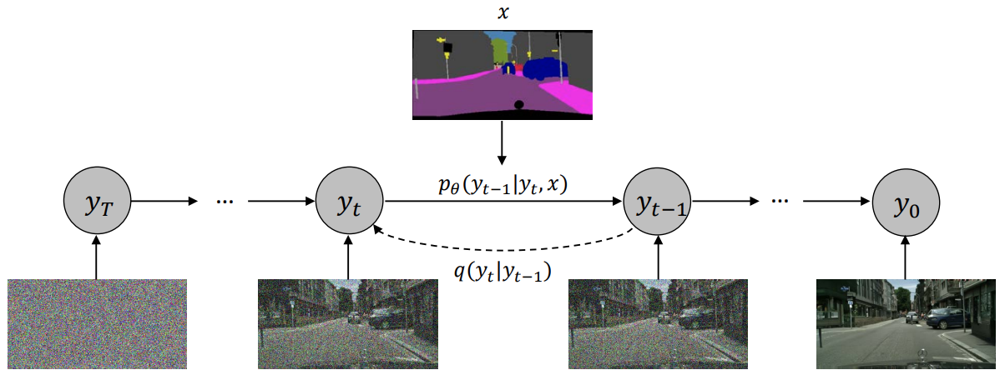
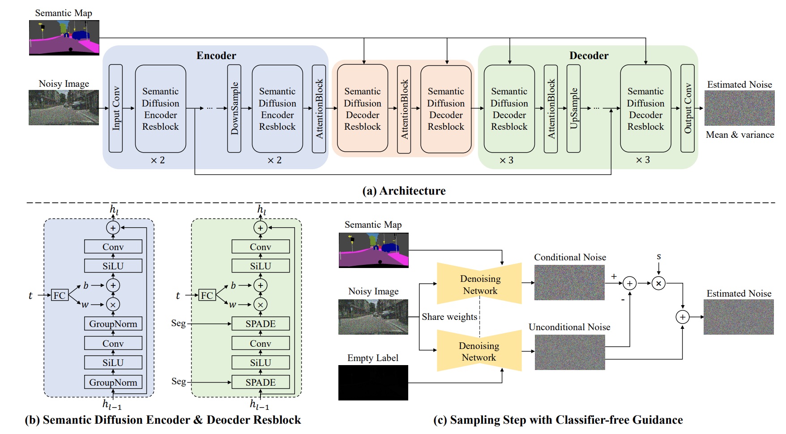

# Semantic Image Synthesis

In this community pipeline, we'll implement Semantic Image Synthesis paper.<br>
**Paper url :** https://arxiv.org/abs/2207.00050<br>
**Authors :** Weilun Wang, Jianmin Bao, Wengang Zhou, Dongdong Chen, Dong Chen, Lu Yuan, Houqiang Li<br>
**Original Implementation :**  https://github.com/WeilunWang/semantic-diffusion-model<br>

## Description of the paper
The paper describe how to generate a synthetic image from a semantic mask throught diffusion model.<br>


For that, a network is used and the semantic mask is injected throught SPADE Normalisation<br>


During the sampling procedure, we have a guidance scale that increase the disentangled component relatively to unconditional generation.

## Implementation
In the implementation, we've done : 
- UNet2DSIS - The model that is use in the paper.
- SemanticOnlyDiffusionPipeline - A pipeline that generate an image based on a mask
- SIS_Dataset - A class in order to consume data from 2 folders (images and masks)
- DDPMTrainingScheduler - A class that inherit from DDPMScheduler and enhances it for training
- train_sis.py - A training procedure that generates and validates the model.

### UNet2DSIS
The model have been implemented for different image resolutions, in order to generate it, we have to use the ***get_config***.

```python
def get_config(img_size:int=512,in_channels:int=3,out_channels:int=3,cls_count:int=None):
    ...
class UNet2DSISModel(ModelMixin,ConfigMixin):
    ...

config = get_config(train_dataset.img_size,input_channels,output_channels,train_dataset.cls_count)
unet = UNet2DSISModel(**config)
```

### DDPMTrainingScheduler
The default DDPMScheduler class suffers when we want to use it with multiple different timesteps at a time.<br>
We've reimplemented something that complies more with this behaviour.
```python
def pick_tensor(values:Union[torch.Tensor,np.ndarray,list],t:Union[torch.Tensor,np.ndarray,int]):
    # Returns a tensor based on index from a list of timesteps
    ...

def adapt_tensor(vector:torch.Tensor,x:torch.Tensor):
    # Adapt a vector tensor [B] to a matrix [B,Whatever] in order to enable multiplication
    ...

class DDPMTrainingScheduler(DDPMScheduler):
    """Override DDPM Scheduler in order to handle training methods...
    """
    def previous_timesteps(self,timesteps:torch.Tensor):
        return torch.tensor([max(self.previous_timestep(t),0) for t in timesteps]).long()
    
    def _get_q_mean_variance(self,timesteps:torch.Tensor,sample_0:torch.Tensor,sample_t:torch.Tensor):
        # Compute q(x_{t-1} | x_t, x_0)
        ...
    
    def _get_variances(self,timesteps:torch.Tensor,predicted_variances:torch.Tensor=None):
        # Compute varianceS for multiple timesteps at a time.
        ...

    def _get_p_mean_variance(self,model_output:torch.Tensor,timesteps:torch.Tensor,scale:float=1.0):
        # Compute p_theta(x_{t-1} | x_t)
        ...
```
More precisely **get_q_mean_variance** :<br>
$q(x_{t-1}|x_t,x_0) \sim \mathcal{N}(x_{t−1}; \tilde{µ_t}(x_t, x_0), \tilde{β_t}.I)$

with :<br>
$\tilde{µ_t}(x_t, x_0)=\frac{\sqrt{\bar{\alpha_{t-1}}}}{1-\bar{\alpha_{t}}}.x_0 + \frac{\sqrt{\alpha_{t}}.(1-\bar{\alpha_{t-1}})}{1-\bar{\alpha_{t}}}.x_t$

$\tilde{β_t} = \frac{1-\bar{\alpha_{t-1}}}{1-\bar{\alpha_{t}}}.β_t$

source : https://arxiv.org/pdf/2006.11239.pdf - equation (6) and (7)

More precisely **get_p_mean_variance** :<br>
$p_{\theta}(x_{t-1}|x_t) $

We have multiple cases :<br>
#### Variance is Learned
- We chunk the output on the dimension 1 to get **model_mean**, **model_var**
- If **learned_range** <br>We predict $\nu$ in [0-1] and $\sum_{\theta}(\tilde{y},x,t) = exp(\nu.logβ_t + (1-\nu).log\tilde{β_t}$
- if **learned** <br>We predict the log variance and $\sum_{\theta}(\tilde{y},x,t) = exp(log_{var})$

#### Variance is fixed
- We do not chunk the output on dimension 1 and only get **model_mean**
- We get variance from $β_t$ or $\tilde{β_t}$

In both cases :
- If a guidance scale is given, we use it and chunk on the dimension 0

source : https://arxiv.org/pdf/2207.00050.pdf - equation (11)

### Training Pipeline
We compute two losses : 
$\mathcal{L} = \mathcal{L_{simple}} + \lambda.\mathcal{L_{vlb}}$

with :<br>
$\mathcal{L_{simple}} = ||\epsilon - M_{prediction}(\sqrt{\alpha_{t}}y + \sqrt{1-\alpha_{t}}\epsilon)||_2$<br>
$\mathcal{L_{vlb}} = KL(p_{\theta}(y_{t-1}|y_{t},x)||q(y_{t-1}|y_{t},y_{0}))$ when $t>0$<br>

Practically, we use **DDPMTrainingScheduler** to compute $p_{\theta}(y_{t-1}|y_{t},x)$ and $q(y_{t-1}|y_{t},y_{0})$.<br>
In this implementation, we **do not** compute $\mathcal{L_{vlb}}$ when t=0