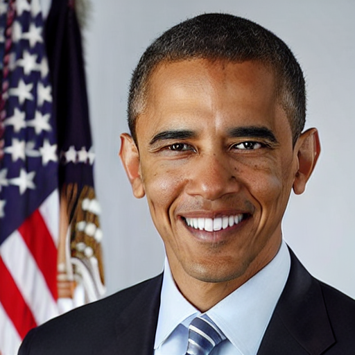
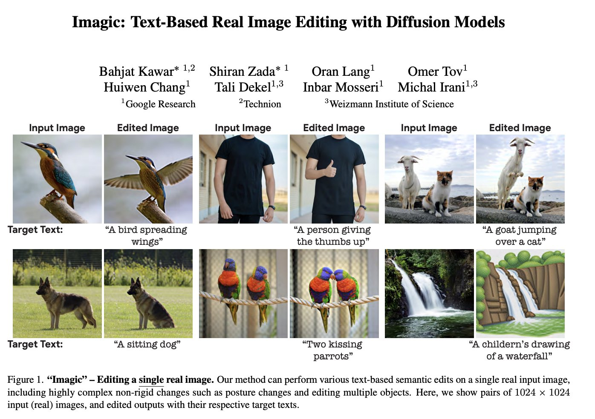

To further reduce VRAM usage, pass `--gradient_checkpointing` and `--use_8bit_adam` flag to use 8 bit adam optimizer from [bitsandbytes](https://github.com/TimDettmers/bitsandbytes).

# DreamBooth training example

[Imagic](https://arxiv.org/abs/2210.09276) is a method for  Text-Based Real Image editing with models like stable diffusion with just one image of a subject.
The `train_imagic.py` script shows how to implement the training procedure and adapt it for stable diffusion.

| Target Text | Input Image | Edited Image |
|-------------|-------------|--------------|
|A photo of Barack Obama smiling with a big grin.|||

TODO: Update README, Please refer to the colab notebook for example usage until then.

